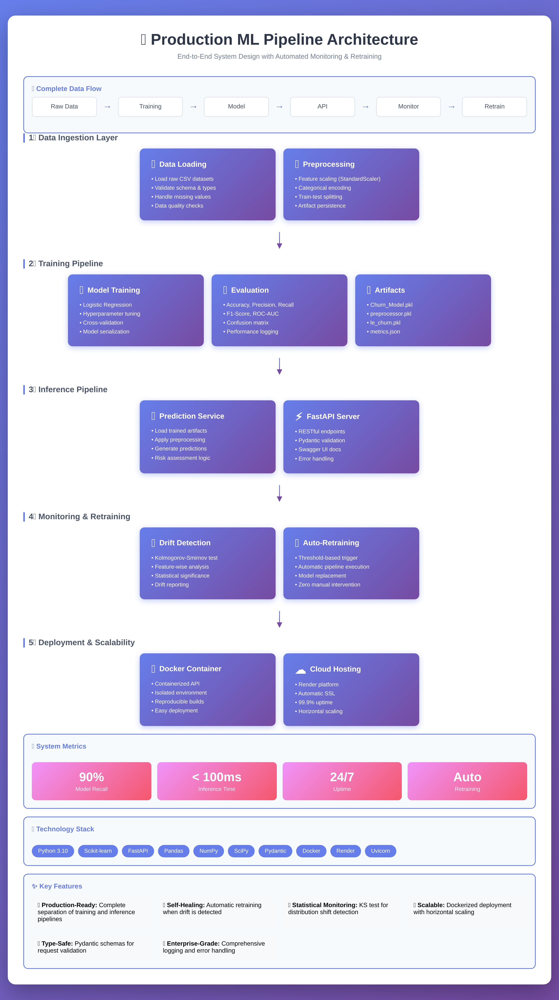

# 🚀 Production ML Pipeline with Drift Monitoring & Auto-Retraining
> **A production-oriented machine learning system** demonstrating the complete ML lifecycle — training, inference, monitoring, drift detection, and automated retraining — deployed as a live FastAPI service.

---

## 🌐 Live Deployment

* **API Base URL:**
  👉 [https://production-ml-pipeline-with-drift-txr3.onrender.com](https://production-ml-pipeline-with-drift-txr3.onrender.com)

* **Swagger Docs:**
  👉 [https://production-ml-pipeline-with-drift-txr3.onrender.com/docs](https://production-ml-pipeline-with-drift-txr3.onrender.com/docs)

> ⚠️ Hosted on Render free tier — initial requests may experience cold start latency.

---

## 🎯 Project Overview

This project focuses on **production ML engineering**, not just model training.

It demonstrates how a real-world ML system should be designed:

* Clear separation between **training and inference**
* Continuous **model monitoring**
* **Statistical drift detection**
* Automated **retraining triggers**
* Scalable **API deployment**

### Business Problem

Predict customer churn based on historical customer attributes to help businesses proactively retain high-risk customers.

---

## 🏗️ System Architecture



**High-level flow:**

```
Raw Data → Training Pipeline → Model Artifacts → API Inference
                               ↓
                        Drift Monitoring
                               ↓
                        Auto Retraining
```

---

## 🧠 Key Capabilities

* ✅ End-to-end ML pipeline (data → model → deployment)
* ✅ Modular training and inference pipelines
* ✅ Statistical drift detection (Kolmogorov-Smirnov test)
* ✅ Threshold-based auto-retraining logic
* ✅ FastAPI inference service
* ✅ Dockerized deployment
* ✅ Centralized logging & error handling

---

## 🛠️ Technology Stack

| Layer           | Tools             |
| --------------- | ----------------- |
| ML              | Scikit-learn      |
| API             | FastAPI, Pydantic |
| Data            | Pandas, NumPy     |
| Drift Detection | SciPy (KS Test)   |
| Deployment      | Docker, Render    |
| Language        | Python 3.10       |

---

## 📁 Project Structure

```
├── data/
│   ├── raw/
│   ├── processed/
│   ├── artifacts/          # Trained model & preprocessors
│   └── drift/              # Baseline & current data
│
├── src/
│   ├── api/                # FastAPI app
│   ├── pipeline/           # Training & inference pipelines
│   ├── monitoring/         # Drift detection & retraining
│   ├── config/             # Paths & configs
│   ├── utils/              # Logger & custom exceptions
│   ├── data_ingestion.py
│   ├── preprocessing.py
│   ├── train.py
│   └── evaluate.py
│
├── docker/
│   └── Dockerfile.api
│
├── docs/
│   ├── architecture.jpg
│   └── architecture.html
│
├── requirements.txt
├── pyproject.toml
└── README.md
```

---

## 🔁 ML Pipeline Breakdown

### 1️⃣ Data Ingestion

* Load raw CSV data
* Handle missing values
* Schema & type validation
* Train-test split

### 2️⃣ Preprocessing

* Numerical scaling (StandardScaler)
* Categorical encoding
* Artifact persistence for inference consistency

### 3️⃣ Model Training

* Logistic Regression classifier
* Hyperparameter configuration
* Model serialization (`.pkl`)

### 4️⃣ Evaluation

* Accuracy, Precision, Recall
* F1-Score, ROC-AUC
* Confusion matrix

---

## ⚡ Inference Pipeline

* Stateless prediction service
* Loads trained artifacts once
* Applies identical preprocessing
* Returns:

  * Churn probability
  * Churn label
  * Risk level
  * Confidence score

### Sample Request

```bash
curl -X POST https://production-ml-pipeline-with-drift-txr3.onrender.com/predict \
-H "Content-Type: application/json" \
-d '{
  "CreditScore": 650,
  "Age": 35,
  "Tenure": 5,
  "Balance": 50000,
  "NumOfProducts": 2,
  "HasCrCard": 1,
  "IsActiveMember": 1,
  "EstimatedSalary": 60000,
  "Geography": "France",
  "Gender": "Male"
}'
```

---

## 📉 Drift Detection

* Uses **Kolmogorov-Smirnov (KS) Test**
* Compares:

  * Training baseline data
  * Recent inference data
* Feature-wise statistical testing
* Drift flagged when `p-value < 0.05`

---

## 🔄 Auto-Retraining Logic

When drift is detected:

1. Validate new data
2. Re-execute training pipeline
3. Evaluate new model
4. Replace old artifacts if performance improves
5. Log retraining event

> Goal: **Keep the deployed model reliable over time without manual intervention**

---

## 🐳 Deployment

* Dockerized FastAPI service
* Stateless API design
* Cloud hosted on Render
* HTTPS enabled by default

---

## 🚀 Local Setup

```bash
git clone https://github.com/Tush2602/Production-ML-Pipeline-with-Drift-Monitoring-Auto-Retraining-Scalable-Deployment.git
cd Production-ML-Pipeline-with-Drift-Monitoring-Auto-Retraining-Scalable-Deployment

pip install -r requirements.txt
uvicorn src.api.app:app --reload
```

Swagger UI:

```
http://localhost:8000/docs
```

---

## 🔮 Future Improvements

* MLflow experiment tracking & model registry
* CI/CD with GitHub Actions
* Unit testing with pytest
* Monitoring dashboards (Grafana)
* Kubernetes deployment
* Model explainability (SHAP)

---

## 👨‍💻 Author

**Tushar Joshi**
B.Tech Electrical Engineering, PEC Chandigarh
Aspiring ML / Data Scientist with strong interest in production ML systems

* GitHub: [https://github.com/Tush2602](https://github.com/Tush2602)
* LinkedIn: [https://www.linkedin.com/in/tushar-joshi-47a5a9311](https://www.linkedin.com/in/tushar-joshi-47a5a9311)

---

## ⭐ Support

If this project helped you or inspired you, consider giving it a ⭐
It helps others discover production-ready ML system design patterns.

---

